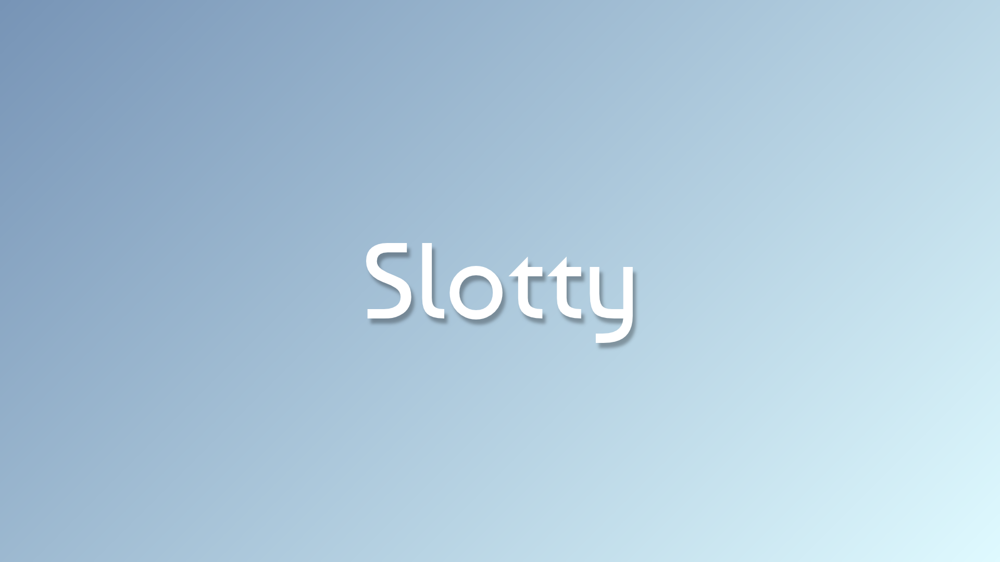

<!-- markdownlint-disable MD033 MD045 MD013 -->

  

<h1 align="center">Slotty</h1>

  <strong>時間枠（スロット）にタスクをセットして集中する、シンプルなTodo＆タイマーアプリ</strong>

  
  
  
  

  

---

## 概要

**Slotty** は、30分などの時間枠（スロット）単位で断続的に進めるルーティンワーク（同じタスクを時間を空けて何度も繰り返す作業）を管理するためのデスクトップアプリです。

「次」という専用の概念を持たず、常に**「今このスロットでやるタスク」**を明確に見せることをコアバリューとして設計されています。

## 特徴

- **「今」やるタスクに集中**: 事前にセットしたタスク群を対象にセッションを開始。タスク間の複雑な優先度や順序に悩まされることなく集中に入れます。
- **直感的なワンタップ操作**: タスク行をクリックするだけで「セット / アンセット」を切り替え。セットされたタスクは自動的に上部にグルーピング。
- **5色のカラープリセット**: タスク追加時に識別しやすい5色（みかん、ピーコック、コバルト、バジル、レモン）を選択可能。
- **クイック時間調整**: タイマー横の鉛筆アイコンから、作業時間（分・秒）をその場で自由に編集可能。
- **ローカル自動保存**: タスク一覧や変更した時間はローカルストレージへ自動保存され、アプリ再起動後も状態を維持。
- **セッション完了通知**: カウントダウン終了時にアラーム音でお知らせ。完了と同時にアクティブタスクが自動でアンセットされ、次回のスロットへスムーズに移行。

## インストール（macOS）

1. [最新の Releases ページ](https://github.com/kmcahfne/slotty/releases/latest) から `slotty-macos.dmg` をダウンロードします。
2. ダウンロードした `.dmg` ファイルをダブルクリックして開きます。
3. `Slotty` アイコンを `Applications`（アプリケーション）フォルダへドラッグ＆ドロップします。
4. 通常通りダブルクリックして起動します。

> **Note**: 本アプリは Apple による公証（Notarization）を受けています。初回起動時に「インターネットからダウンロードされたアプリケーションです」という確認が出た場合は「開く」をクリックしてください。

## ライセンス

[MIT License](LICENSE)
